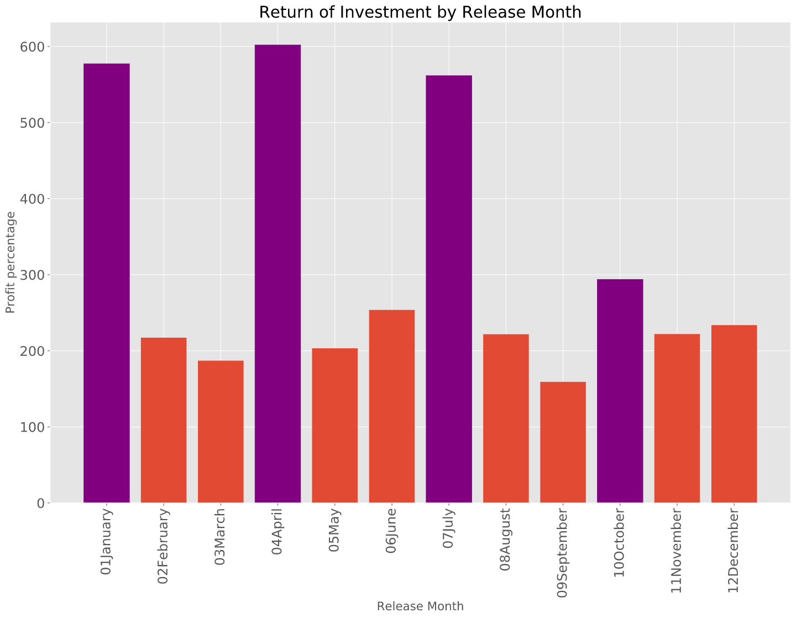
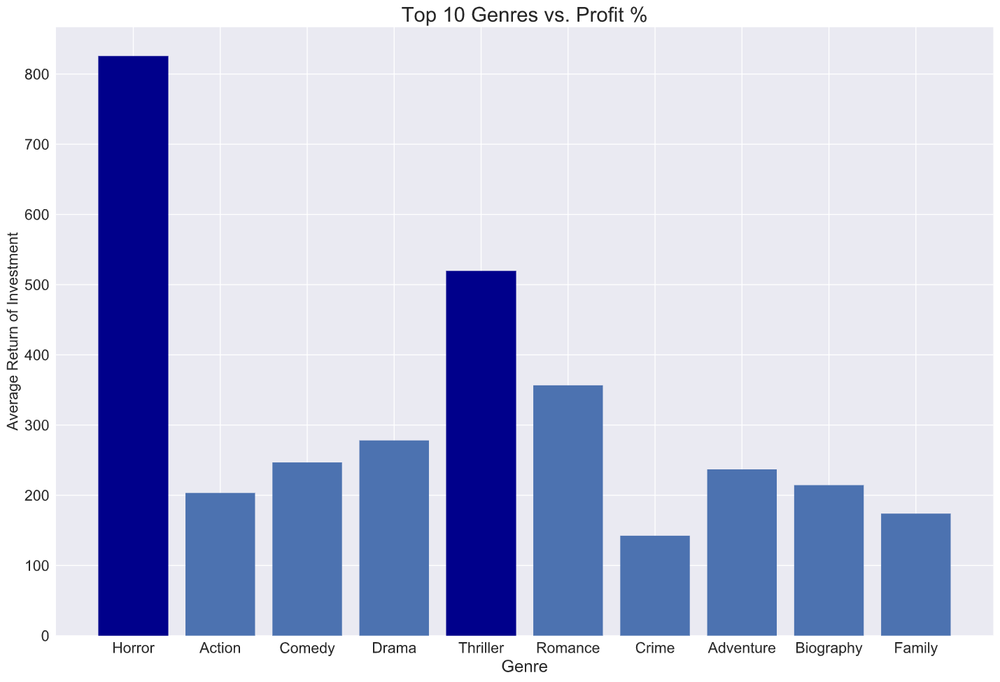
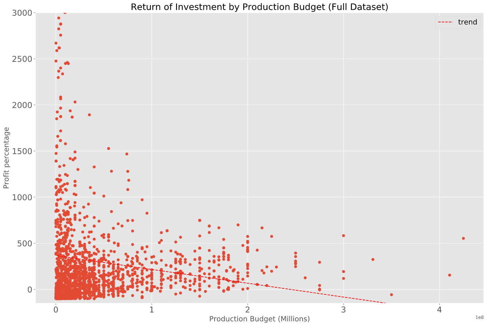
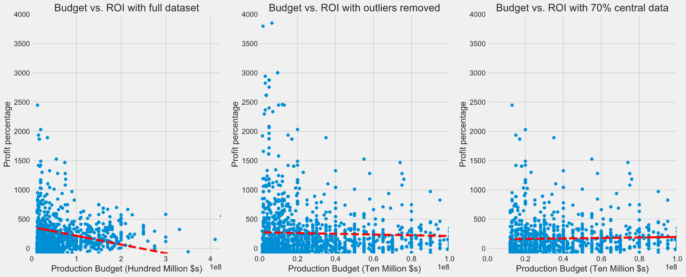
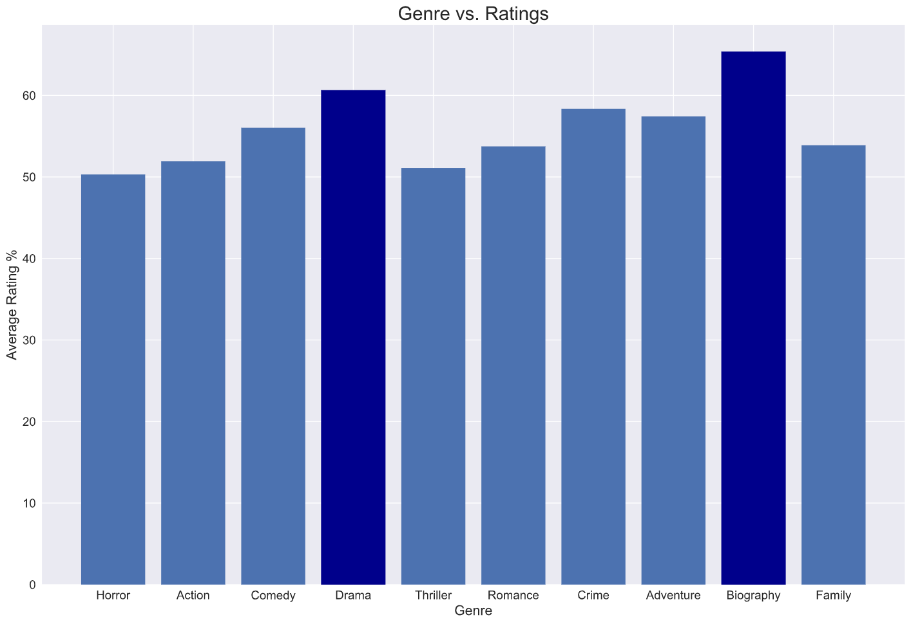

# Movie Data Analysis for Profitability

**Authors**: David Shin, Nick Subic

## Overview

For this project, we've been prompted to gather and analyze data about the movie industry in order to find insights on what makes a movie studio successful.

## The Studio

Microsoft has decided to join other tech giants like Apple and Amazon by creating its own movie studio. Because it will be creating a new brand, Microsoft wants to produce market research to describe the making of a successful movie and translate that into a series of guidelines for reproducing that success.


## Our Hypotheses

There is an optimum season to release movies, and we can break that down to month.

Some genres of movies are inherently more profitable than others. We can find out which, and use our findings to recommend content creation.

Budget is a predictor of which movies are most profitable. We can isolate a production budget window that is more likely to produce a good return.

Ratings are a driver for reviews, attention, press and word of mouth. We believe we can find a correlation between ratings and profitability, and if so, use that correlation to further explore the factors of a highly rated film using our other metrics.

## Methods

We believe the biggest determining factor in the success of a movie studio is profit. We used the difference between International Gross and budget and calculated it as a percentage of profit, or ROI. 

Next, we seperated our movies by the categories from our hypotheses and analyzed the data for patterns or trends. By reducing our sample size to recent movies that are relevant to our questions and aggregating our data, we were able to plot data from each of the four categories.

## Results

We calculated correlations between out four metrics and ROI and used a series of data visualizations to describe the data.

### Hypothesis 1- There is an optimal season to release movies.

Our first hypothesis proved solid. Our data yeilded a group of four months with higher profits than the rest, which occur at three month increments, allowing a movie studio to release new titles throughout the year while maximizing profit through smart timing. 

### Hypothesis 2- Some genres are more profitable in the box office than others

Again, our hypothesis proved solid. Horror far out performed all other genres, while Thriller and Romance movies both showed solid average returns.

### Hypothesis 3- Budget is a predictor of profit

This time our hypothesis was not vindicated by the initial inspection of the data. We can see from our initial analysis a negative trend as budgets increase. Because our dataset had so many outliers, we chose to dig a bit deeper and see what profitability looked like inside a narrower window.


By removing outlying data, then narrowing our data to the central 70%, we see the trend line flatten and then move toward positive, signalling a window of more likely profit. While this still doesn't look like a strong indicator, it does give us some parameters to guide movie budgets in order to improve the likelihood of higher profit.

### Hypothesis 4- Ratings are a predictor of profit

This hypothesis proved to be the least predictive of profit. Because ratings were such a poor measure of a movie's box office success, we chose not to fully explore ratings across our other factors, though we did compare with genre.


Our most profitable genre, Horror, also had the lowest average ratings. While we thing quality and ratings are important to making and promoting movies, they are clearly not an important predictor of profit.

## Conclusion

Out of the factors we tested, the best predictors of profit were genre and release date. 

Movies tend to bring in the most profit in January, April, July and October, with July being the highest on average. 

Of the top occuring genres that we tested, Horror, Thrillers and Romance movies generated the highest average profits.

Production Budget is a weak predictor, but by narrowing our budget window we found it was possible to generate a higher likelihood of profit. Our optimized budget window is 12 to 200 million USD.

We found no correlation between ratings and profit. We believe ratings can improve the distribution of titles and that when ratings are high, re-watching is more likely, which could have a positive effect on revenue should Microsoft opt to start a streaming service with its movie studio, similar to Disney Plus. It's also possible that highly acclaimed titles could draw subscribers to such a service, though because the subscriptions don't indicate individual use, this is much harder to guage. 

## Recommendation

Based on our conclusions, we recommend Microsoft develop a studio focused on releasing exciting movies in the Horror and Thriller genres on a quarterly basis, focusing especially on April and July releases. To optimize the chances of a good return, the budget for these movies should fall between 12 and 200 million dollars. While we believe creating a quality film and achieving high critical ratings is important, it doesn't seem to effect the bottom line and is therefore a lower priority than following our other recommendations.

## Further Questions

Does a roster of highly acclaimed movies effect subscription rates to streaming services? Do streams improve a film's gross, or does the streaming service pay a flat licensing fee regardless of number of streams?

These further questions would better inform the longterm benefits of producing highly rated titles, and would be more easily explored via the APIs of services like Netflix, Amazon Prime or Disney Plus. 

## Links to notebook and presentation slides

* [Our Notebook](https://github.com/bagnine/moviedata/blob/master/Code/moviedata.ipynb)
* [Data cleaning functions](https://github.com/bagnine/moviedata/blob/master/Code/data_func.py)
* [Web scraping functions](https://github.com/bagnine/moviedata/blob/master/Code/scrape.py)
* [Presentation Slides](https://github.com/bagnine/moviedata/blob/master/DS_Project_Presentation.pdf)

## Repository structure

```
├── README.md                           <- The top-level README for reviewers of this project
├── DS_Project_Presentation.pdf         <- PDF version of project presentation
├── code
│   ├── moviedata.ipynb                 <- Our notebook
│   ├── data_func.py                    <- .py functions for data cleaning
|   ├── scrape.py                       <- .py functions for web scraping
├── data                                <- Both provided and web scraped
└── images                              <- Visualizations used in README
```